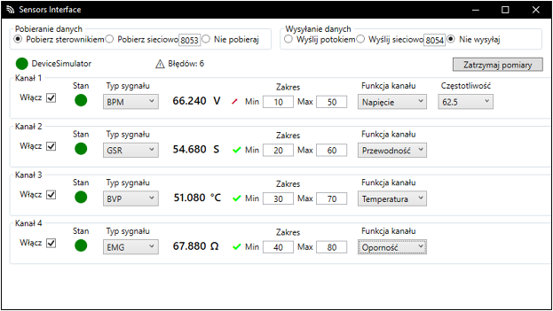

[Polski](Readme/README_PL.md)
# Sensors Interface
**Technologies**
C#, WPF 

A desktop application that is the interface between the sensors and the receiving application. The recipient tested was VRTherapy, an application from the University of Siedlce to support psychological therapy (see more [LinkedIn](https://www.linkedin.com/in/sebastian-dreszer-0b0220315/details/experience/)). 
The application detects the connected sensor, retrieves values from it, normalizes the values to the medical [FHIR](https://hl7.org/fhir/) standard and then sends them to the receiving application. The receiver must also use this standard. However, if it does not use it, it can easily add support for it, by including the [FHIR library](https://github.com/Shrillbug321/FHIR). 
The basis for sensor configuration is present - channel on/off, download frequency, type of measured value (temperature, resistance). 
The modes for downloading sensor data are directly from the controller and via the network after UDP, and the modes for sending are by pipeline (via RAM) and via the network.

**Launching**
1. Download .exe file from [Google Drive](https://drive.google.com/drive/folders/1E7LnF_kR296CZE5gu5COGcHTbI8humKa)
2. Install .NET 8
3. Run .exe file (default is running with simulated device, that you can tested program)

Interface view. At the top, the download and upload modes are selected. Below this are the status and name of the device and a counter for erroneously received values. Next are the channels (the number depends on the device), which can be configured. 

The interface sends the signal values to VRTherapy. The values differ a little, due to the different refresh rates of the two applications (by the way, the signal visualization window in VRTherapy is also my creation :)) 
