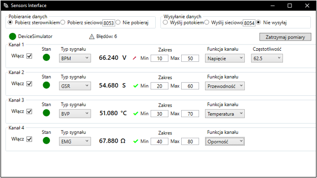
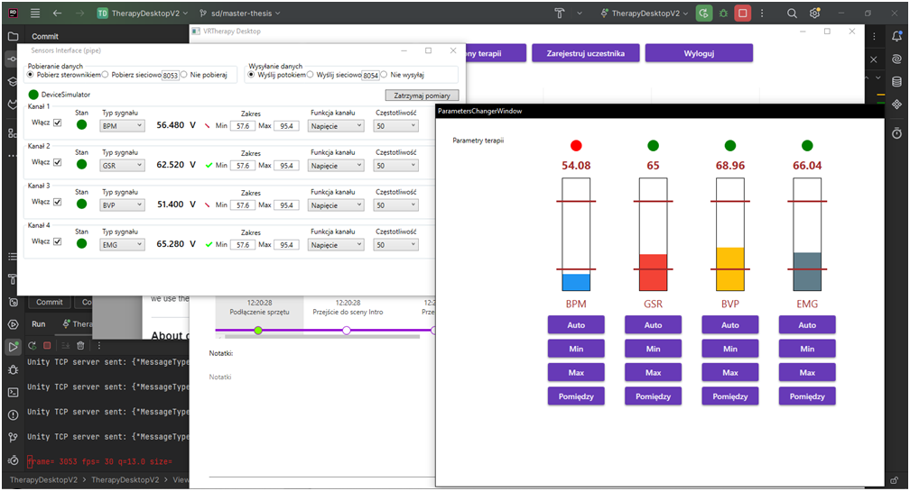

[English](../README.md)
# Interfejs czujników
**Technologie**
C#, WPF 

Aplikacja desktopowa będąca interfejsem między czujnikami a aplikacją odbierającą. Testowanym odbiorcą było VRTherapy — aplikacja Uniwersytetu w Siedlcach do wspierania terapii psychologicznej (więcej patrz [LinkedIn](https://www.linkedin.com/in/sebastian-dreszer-0b0220315/details/experience/)).
Aplikacja wykrywa podłączony czujnik, pobiera z niego wartości, normalizuje wartości do medycznego standardu [FHIR](https://hl7.org/fhir/), a następnie wysyła do aplikacji odbierającej. Odbiorca musi również używać tego standardu. Jeśli jednak nie używa, to może łatwo jej dodać obsługę, przez dołączenie [biblioteki FHIR](https://github.com/Shrillbug321/FHIR). 
Obecna jest podstawa konfiguracja czujników — włączenie/wyłączenie kanału, częstotliwość pobierania, rodzaj mierzonej wartości (temperatura, opór). 
Tryby pobierania danych z czujników to bezpośrednio ze sterownika i przez sieć po UDP, a tryby wysyłania to potokiem (po ang. _pipe_, czyli przez RAM) i przez sieć.

**Uruchamianie**
1. Pobieramy plik .exe z [dysku Google](https://drive.google.com/drive/folders/1E7LnF_kR296CZE5gu5COGcHTbI8humKa)
2. Instalujemy .NET 8
3. Uruchamiamy plik .exe (domyślnie uruchamia się z włączonym urządzeniem symulacyjnym, żeby móc przetestować działanie)

Widok interfejsu. Na górze wybiera się tryb pobierania i wysyłania danych. Poniżej znajduje się stan i nazwa urządzenia oraz licznik błędnie otrzymanych wartości. Następnie znajdują się kanały (liczba zależna od urządzenia), które można konfigurować. 

Interfejs wysyła wartości sygnałów do VRTherapy. Wartości trochę się różnią, ze względu na różne odświeżaniu obu aplikacji (swoją drogą, okno wizualizacji sygnałów w VRTherapy to też moje dzieło :)) 
